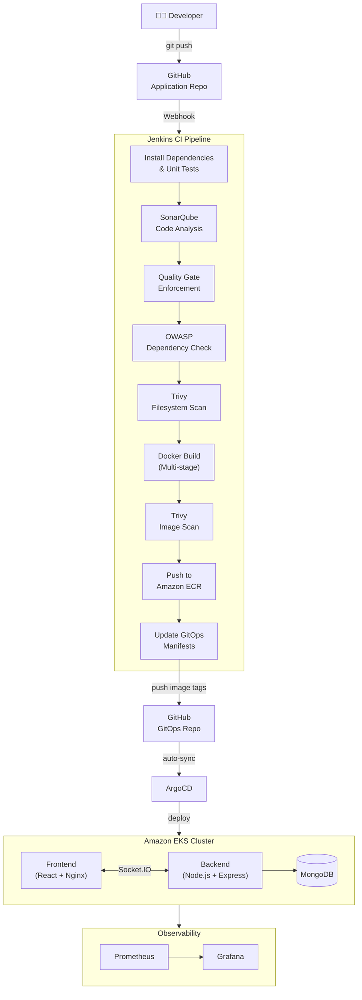
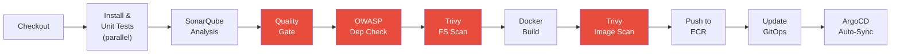

# Full Stack Chat Application – DevSecOps CI/CD Pipeline

[]()
[]()
[]()
[]()
[]()

A production-ready **MERN stack chat application** with a complete **DevSecOps CI/CD pipeline**. The system automatically builds, tests, scans for vulnerabilities, containerizes, and deploys to **Amazon EKS** using **GitOps with ArgoCD**. Security is enforced at every stage through **SonarQube**, **OWASP Dependency-Check**, and **Trivy** scanning.

---

## Architecture



---

## Tech Stack

### Application

| Layer | Technology |
|-------|-----------|
| **Frontend** | React.js, Vite, Tailwind CSS |
| **Backend** | Node.js, Express.js, Socket.IO |
| **Database** | MongoDB |
| **Real-time** | WebSockets via Socket.IO |

### DevOps & Infrastructure

| Category | Tools |
|----------|-------|
| **CI Server** | Jenkins (Declarative Pipeline) |
| **Container Runtime** | Docker (Multi-stage builds, non-root user) |
| **Container Registry** | Amazon ECR |
| **Orchestration** | Amazon EKS (Kubernetes) |
| **GitOps / CD** | ArgoCD (auto-sync from GitOps repo) |
| **IaC** | Terraform |

### Security (DevSecOps)

| Tool | Scan Type | Pipeline Behavior |
|------|-----------|------------------|
| **SonarQube** | Static Application Security Testing (SAST) | Fails build on Quality Gate red |
| **OWASP Dependency-Check** | Software Composition Analysis (SCA) | Fails on ≥1 Critical, unstable on ≥5 High |
| **Trivy (Filesystem)** | Filesystem vulnerability scan | Reports HIGH, fails on CRITICAL |
| **Trivy (Image)** | Container image vulnerability scan | Reports HIGH, fails on CRITICAL |

### Monitoring

| Tool | Purpose |
|------|---------|
| **Prometheus** | Metrics collection & alerting |
| **Grafana** | Dashboards & visualization |

---

## Repository Structure

```
Full_Stack_Chatapp_CICD/
├── backend/
│   ├── src/
│   │   └── index.js            # Express + Socket.IO server
│   ├── Dockerfile              # Multi-stage, non-root, HEALTHCHECK
│   ├── .dockerignore
│   ├── package.json
│   └── package-lock.json
├── frontend/
│   ├── src/                    # React + Vite source
│   ├── Dockerfile
│   ├── package.json
│   └── package-lock.json
├── Jenkinsfile                 # Declarative CI/CD pipeline
├── .env.example                # Environment variable template
├── .gitignore
└── README.md
```

---

## CI/CD Pipeline – Stage Breakdown

The Jenkins Declarative Pipeline executes 12 stages with built-in parallelism, security gates, and automated GitOps delivery:



<span style="color: red;">■</span> **Red stages** = Security gates that can fail the build

| # | Stage | Description |
|---|-------|-------------|
| 1 | **Checkout** | Clones source code, captures Git SHA for traceability |
| 2 | **Install & Unit Tests** | Runs `npm ci` + `npm test` for backend and frontend **in parallel** |
| 3 | **SonarQube Analysis** | Scans `backend/src` and `frontend/src` for code quality issues |
| 4 | **Quality Gate** | Waits for SonarQube verdict — **aborts pipeline if gate is red** |
| 5 | **OWASP Dependency-Check** | Scans dependencies — **fails on ≥1 Critical**, unstable on ≥5 High |
| 6 | **Trivy FS Scan** | Scans the filesystem for vulnerabilities, outputs report |
| 7 | **Docker Build** | Multi-stage builds for both frontend and backend |
| 8 | **Trivy Image Scan** | Scans built images — **fails on CRITICAL** severity |
| 9 | **Push to ECR** | Pushes images with `BUILD_NUMBER` and `latest` tags |
| 10 | **Update GitOps** | Clones GitOps repo, updates K8s manifest image tags via `sed`, commits and pushes |
| 11 | **ArgoCD Auto-Sync** | ArgoCD detects the commit and rolls out new images to EKS |

### Pipeline Configuration

```groovy
environment {
    AWS_ACCOUNT_ID = '034768441662'
    AWS_REGION     = 'ap-south-1'
    ECR_REGISTRY   = "${AWS_ACCOUNT_ID}.dkr.ecr.${AWS_REGION}.amazonaws.com"
    BACKEND_REPO   = 'chatapp-backend'
    FRONTEND_REPO  = 'chatapp-frontend'
    IMAGE_TAG      = "${BUILD_NUMBER}"     // immutable, traceable tag
    GITOPS_REPO    = 'github.com/JyothiKumar37/Full_Stack_Chatapp_GITOPS.git'
}
```

---

## Docker Best Practices Implemented

The backend Dockerfile follows production-grade container security:

| Practice | Implementation |
|----------|---------------|
| **Multi-stage build** | Separate `builder` and production stages to minimize image size |
| **Non-root user** | `appuser` via `addgroup`/`adduser` — container never runs as root |
| **OS patch** | `apk upgrade --no-cache` in the production stage |
| **Health check** | `HEALTHCHECK` hitting `/health` endpoint every 30s |
| **Minimal attack surface** | Global `npm`/`npx` removed from production image |
| **Alpine base** | `node:22-alpine` for smallest footprint |
| **Production mode** | `NODE_ENV=production` and `npm ci --only=production` |

---

## GitOps Deployment Flow

```
CI Pipeline completes
       │
       ▼
Jenkins clones GitOps repo
       │
       ▼
sed updates image tags in k8s/backend-deployment.yaml
sed updates image tags in k8s/frontend-deployment.yaml
       │
       ▼
git commit -m "Deploy Build ${BUILD_NUMBER}"
       │
       ▼
git push to GitOps repo (master)
       │
       ▼
ArgoCD detects change → auto-syncs EKS cluster
```

**GitOps Repository:** [Full_Stack_Chatapp_GITOPS](https://github.com/JyothiKumar37/Full_Stack_Chatapp_GITOPS)

---

## Monitoring & Observability

Prometheus scrapes application and cluster metrics, visualized through Grafana dashboards:

| Metric | Source |
|--------|--------|
| Request Rate & Total Requests | Application metrics |
| CPU & Memory Usage | Node Exporter / cAdvisor |
| Pod Status & Restarts | kube-state-metrics |
| Container Resource Limits | Kubernetes metrics |

---

## Environment Variables

Copy `.env.example` to `.env` before deployment:

| Variable | Description | Default |
|----------|------------|---------|
| `MONGO_USERNAME` | MongoDB root username | `mongoadmin` |
| `MONGO_PASSWORD` | MongoDB root password | *(change this)* |
| `JWT_SECRET` | Secret for signing auth cookies | *(generate with `openssl rand -base64 48`)* |
| `CORS_ORIGINS` | Allowed CORS origins (`*` or comma-separated) | `*` |
| `FRONTEND_PORT` | Host port for frontend (Nginx) | `80` |

---

## AWS Services

| Service | Purpose |
|---------|---------|
| **Amazon EKS** | Managed Kubernetes cluster for application workloads |
| **Amazon ECR** | Private container registry for Docker images |
| **IAM** | Role-based access for Jenkins, EKS, and ECR |

---

## Related Repository

| Repository | Purpose |
|-----------|---------|
| [Full_Stack_Chatapp_GITOPS](https://github.com/JyothiKumar37/Full_Stack_Chatapp_GITOPS) | Kubernetes manifests + ArgoCD config (GitOps repo) |

---

## Author

**Pasupula Jyothi Kumar Reddy**

[](https://www.linkedin.com/in/pasupula-jyothi-kumar-reddy-211481209)
[](https://github.com/JyothiKumar37)

DevOps Engineer | Docker | Kubernetes | Terraform | AWS | Jenkins | GitHub Actions
